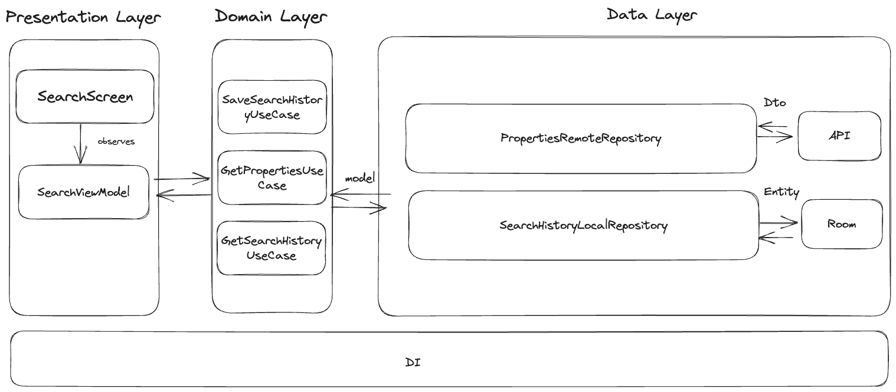

# Shackle Android Developer Coding Task

This is short description of developed mobile app.

This is the architecture of the project:

### The project consists of

- Presentation layer (all UI classes and ViewModel)
- Domain layer (UseCases and Repository interfaces)
- Data layer (Data Transfer Object (DTO) and repository implementations, data sources, mappers)

### Also I added unit tests for (didn't cover all domain due to lack of time)

- PropertyMapperTest
- For domain and data layers

### Libraries

- Hilt for DI
- Kotlin Coroutines/Flow for reactive stream
- Retrofit and GSON for network requests
- Mockito, Junit for Unit tests

### Possible improvements
- Write Unit Tests and add UI tests
- Date choosing logic does not have enough checks.
- Remove Api Key, currently it is located in token.properties. It is better to put this file in .gitignore. I added it to the project just for demo
